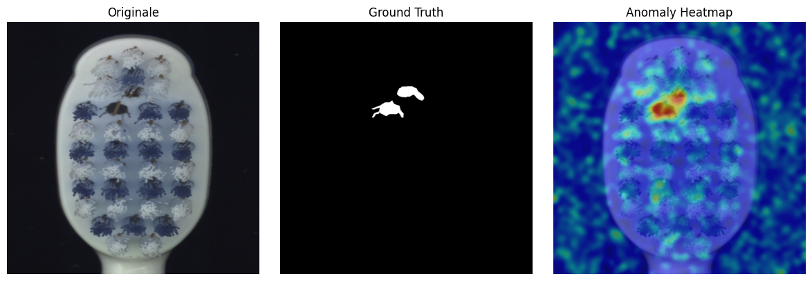
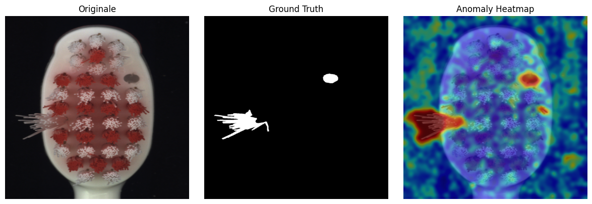
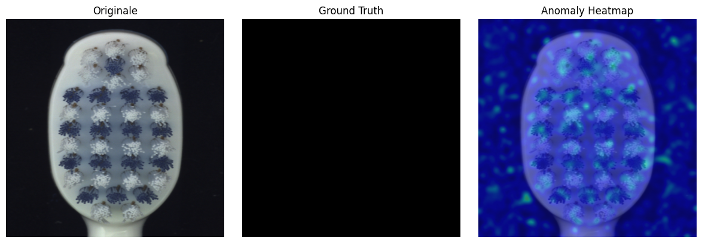
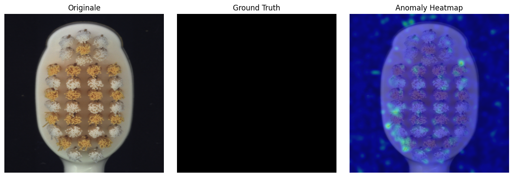

# DINOv2-PaDiM Anomaly Detection

Unsupervised surface anomaly detection on the MVTec AD dataset using DINOv2 patch features and PaDiM.

---

## Overview

This project detects surface defects without any anomalous training examples. A frozen DINOv2 ViT-B/14 extracts patch-level features from normal images; PaDiM then models the per-patch feature distribution as a multivariate Gaussian. At inference, Mahalanobis distance from the learned distribution is computed per patch and calibrated to a `[0, 1]` anomaly score via a sigmoid function anchored to per-patch training quantiles.

---

## Architecture

```
Input image (1120×1120, cropped)
        │
        ▼
DINOv2 ViT-B/14  ──  forward_features()  →  patch tokens  (80×80×768)
        │
        ▼
Random channel subsampling  (768 → d_reduced=12, seed=42, fixed at train time)
        │
        ├─ [Train]  PaDiM fit:  μ, Σ⁻¹ per patch  →  padim_stats.pt
        │
        └─ [Test]   Mahalanobis distance per patch  (80×80 map)
                        │
                        ▼
            Sigmoid normalization:  s = 1 / (1 + k · exp(τ − d))
            τ = 99.9th-percentile of train distances (per patch)
                        │
                        ▼
            Bicubic upsample to original resolution  →  anomaly heatmap
```

**Key design choices**

| Component | Detail |
|---|---|
| Backbone | `vit_base_patch14_reg4_dinov2.lvd142m` (timm) |
| Patch grid | 80 × 80 at 1120 × 1120 input (patch size 14) |
| Feature dim | 768 → 12 (random selection at train time, stored in `padim_stats.pt`) |
| Covariance | Full per-patch C×C matrix with ε=0.01 Tikhonov regularisation |
| Score calibration | Per-patch sigmoid with k=1.6, τ at 99.9th percentile |

---

## Results — MVTec AD (Toothbrush)

Evaluated on 42 test images (30 defective, 12 good). Threshold fixed at 0.7.

### Image-level

| Metric | Value |
|---|---|
| AUROC | 0.754 |
| Recall | **1.000** |
| Precision | 0.714 |
| F1 | 0.833 |

### Pixel-level

| Metric | Value |
|---|---|
| AUROC | 0.904 |
| AUPRO (FPR ≤ 0.3) | **0.609** |

> Recall is 1.0 at image level (zero missed defects). AUPRO of 0.61 indicates accurate region-level localisation; pixel-AUROC of 0.90 confirms the score map discriminates normal from anomalous pixels well across thresholds.

---

## Visual Output

Each test image is saved to `output/` as a three-panel figure: original — ground-truth mask — anomaly heatmap overlay.






---

## Setup & Installation

```bash
git clone https://github.com/<your-username>/dinov2-padim-anomaly-detection.git
cd dinov2-padim-anomaly-detection

python -m venv .venv
# Windows
.venv\Scripts\activate
# Linux / macOS
source .venv/bin/activate

pip install -r requirements.txt
```

### Dataset

Download the MVTec AD dataset (see [Dataset](#dataset) section) and place it at:

```
data/
└── toothbrush/
    ├── train/
    │   └── good/          # normal images only
    ├── test/
    │   ├── good/
    │   └── defective/
    └── ground_truth/
        └── defective/     # binary masks (*_mask.png)
```

Edit `settings.YAML` to point to a different category or adjust image dimensions.

### Train

```bash
python train.py
# model/padim_stats.pt is written on completion
```

### Test

```bash
python test.py
# output/results.pt and output/*.png are written
```

### Metrics

```bash
python metrics.py
# prints image- and pixel-level AUROC, AUPRO, F1; writes output/metrics.json
```

---

## Project Structure

```
dinov2-padim-anomaly-detection/
├── src/
│   ├── dataset.py          # ToothbrushImageDataset, CropSides transform
│   ├── dino_extractor.py   # DINOv2 loading, patch-spatial feature extraction
│   ├── padim.py            # Gaussian fit, Mahalanobis distance, sigmoid normalisation
│   └── utils.py            # heatmap overlay visualisation
├── data/                   # MVTec AD data (not tracked)
├── model/                  # padim_stats.pt written by train.py (not tracked)
├── output/                 # per-image PNGs + results.pt + metrics.json
├── train.py                # training entry point
├── test.py                 # inference entry point
├── metrics.py              # AUROC / AUPRO / F1 evaluation
├── settings.YAML           # all hyperparameters and paths
└── requirements.txt
```

---

## Dataset

**MVTec Anomaly Detection Dataset** — Bergmann et al., CVPR 2019.  
15 industrial object and texture categories with pixel-accurate defect annotations.  
[mvtec.com/company/research/datasets/mvtec-ad](https://www.mvtec.com/company/research/datasets/mvtec-ad)

---

## References

1. **DINOv2** — Oquab et al., *DINOv2: Learning Robust Visual Features without Supervision*, Meta AI, 2023. [arXiv:2304.07193](https://arxiv.org/abs/2304.07193)

2. **PaDiM** — Defard et al., *PaDiM: a Patch Distribution Modeling Framework for Anomaly Detection and Localization*, ICPR 2021. [arXiv:2011.08785](https://arxiv.org/abs/2011.08785)

3. **MVTec AD** — Bergmann et al., *MVTec AD — A Comprehensive Real-World Dataset for Unsupervised Anomaly Detection*, CVPR 2019. [DOI:10.1109/CVPR.2019.00982](https://doi.org/10.1109/CVPR.2019.00982)
